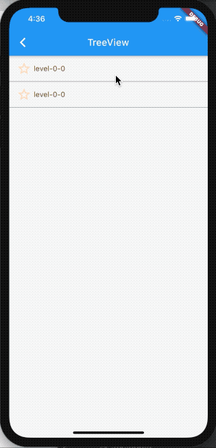
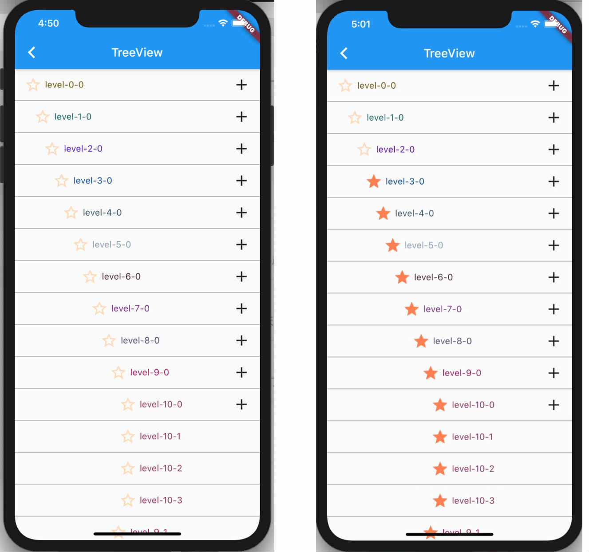

## ListTreeView
[A treeview for Flutter. Based on the listview](https://github.com/sooxie/list_treeview)

- Highly customizable. It only manages the tree structure of the data, and the UI is designed by yourself.
- Performance is efficient because of the Listview's reuse mechanism.
- Infinitely increasing child levels and child nodes






## Getting Started

### Installation

##### 1. Depend on it
```yaml
dependencies:
  list_treeview: [version]
```

##### 2. Install it
```dart
$ flutter pub get

```

#####  3. Import it
```dart
import 'package:list_treeview/list_treeview.dart';

```

## Usage


#### 1、initialize controller.
The controller must be initialized when the treeView create
```dart
class _TreePageState extends State<TreePage> {
  TreeViewController _controller;
  @override
  void initState() {
    super.initState();
    ///The controller must be initialized when the treeView create
    _controller = TreeViewController();
  }
}
```


#### 2、Set the data for each row.
- Your data class must inherit from **Nodedata**, and you can customize other properties of the class.

```dart
/// The data class that is bound to the child node
/// You must inherit from NodeData ！！！
/// You can customize any of your properties
class TreeNodeData extends NodeData {
  TreeNodeData({this.label,this.color}) : super();

  /// Other properties that you want to define
  final String label;
  final Color color;
  String property1;
  String property2;
  String property3;
  ///...
}
```

- Set the TreeView's data, use '_controller.treeData()'

```dart
void getData() async {
    print('start get data');
    _isSuccess = false;
    await Future.delayed(Duration(seconds: 2));

    var colors1 = TreeNodeData(label: 'Colors1');
    var color11 = TreeNodeData(
        label: 'rgb(0,139,69)', color: Color.fromARGB(255, 0, 139, 69));
    var color12 = TreeNodeData(
        label: 'rgb(0,139,69)', color: Color.fromARGB(255, 0, 191, 255));
    var color13 = TreeNodeData(
        label: 'rgb(0,139,69)', color: Color.fromARGB(255, 255, 106, 106));
    var color14 = TreeNodeData(
        label: 'rgb(0,139,69)', color: Color.fromARGB(255, 160, 32, 240));
    colors1.addChild(color11);
    colors1.addChild(color12);
    colors1.addChild(color13);
    colors1.addChild(color14);

    var colors2 = TreeNodeData(label: 'Colors2');
    var color21 = TreeNodeData(
        label: 'rgb(0,139,69)', color: Color.fromARGB(255, 255, 64, 64));
    var color22 = TreeNodeData(
        label: 'rgb(0,139,69)', color: Color.fromARGB(255, 28, 134, 238));
    var color23 = TreeNodeData(
        label: 'rgb(0,139,69)', color: Color.fromARGB(255, 255, 106, 106));
    var color24 = TreeNodeData(
        label: 'rgb(0,139,69)', color: Color.fromARGB(255, 205, 198, 115));
    colors2.addChild(color21);
    colors2.addChild(color22);
    colors2.addChild(color23);
    colors2.addChild(color24);

    /// set data
    _controller.treeData([colors1, colors2]);
    print('set treeData suceess');

    setState(() {
      _isSuccess = true;
    });

  }

```

#### Insert

```dart
_controller.insertAtFront(dataNode,newNode);
//_controller.insertAtRear(dataNode, newNode);
//_controller.insertAtIndex(1, dataNode, newNode);
```

#### Remove

```dart
_controller.removeItem(item);
```

#### Expand or collapse children
```dart
/// Control item to expand or collapse
/// [index] The index of the selected item
_controller.expandOrCollapse(index);
```

#### Selected
```
/// select only itself
_controller.selectItem(item);

/// Select itself and all child nodes
_controller.selectAllChild(item);
```


